<h1>Dagelijkse Logboek</h1>

<h2>Dag 2 04/04/2026</h2>

<h3>Wat heb ik vandaag gedaan?</h3>

Vandaag begon de dag met 2 Workshops. Ik volgde de API Basics en de API voor Gevorderen Workshops. De eerste workshop kon ik goed bijhouden, ik heb er veel van geleerd. Nu ken ik de Basics van API's. Ik weet wat het is, wat het doet en hoe je een API oproept. De tweede Workshop vond ik lastig. Ik kon het eerst goed bijhouden, maar na een tijdje kon ik het niet meer volgen. Verder ben ik bezig geweest met mijn eigen website. Ik ben begonnen met de HTML, maar daar was ik al best snel klaar mee. Daarna heb ik geexperimenteerd met de figuurtjes en vormpjes van mijn sleutelhanger

<h3>Hoelang duurde het?</h3>

Workshops: 2 uur

HTML op orde stellen: 1 uur 

Figuurtjes en Vormen en Responsiveness: 2 uur

Bright/Dark Mode 1 uur

Lezing van Killian: 1.5uur

<h3>Wat heb ik geleerd?</h3>

Ik heb geleerd wat API's zijn en hoe ze werken. Ook heb ik mijn kennis verbreedt over elementen positioneren en vormgeven.

<h3>Wat ga ik morgen doen?</h3>

Morgen wil ik verder met Dark/Bright mode, ook wil ik mijn kleurenpallet op orde stellen. En dan kijken of ik nog verder kan met de vormgeving.
Dag 3 05/06/2026</h2>

<h3>Wat heb ik vandaag gedaan?</h3>

 Vandaag ben ik de dag wederom begonnen met 2 workshops. Ik vond beide workshops heel interessant. De eerste ging over Theming. Hier heb ik geleerd hoe je meet root (of html) thema's kunt creeeren voor je light/dark mode. Ook heb ik geleerd dat het eigenlijk handiger is om HSL of OKLCH te gebruiken in plaats van RGB omdat je beter kunt inschatten welke kleur het is op basis van de code. De tweede workshop gaf mij weer een refresh over hoe je eigenlijk moest coderen om een responsive site te maken. We oefenden met maxwidth en maxheight. En ik heb een tip gekregen die ik handig vind en gelijk heb toegepast bij mijn eigen site, namelijk "Clamp". Verder heb ik alle tips die ik bij de workshops heb gekregen toegepast in mijn eigen code. Ik heb ook kleuren, fonts en plaatjes uitgezocht. 

<h3>Hoelang duurde het?</h3>

Workshop's: 2uur

Workshop Tips toepassen in eigen Site: 2 uur

Kleuren, Lettertype's en SVG's zoeken: 1 uur

Werken aan Readme: 1 uur

<h3>Wat heb ik geleerd?</h3>

Ik heb veel heleerd van de workshop vandaag. Worshop 1 ging over Theming (Light Mode en Dark Mode). IK heb geleerd waarom sommigen HSL, OKLCH en RGB gebruiken. Ook heb ik geleerd hoe je Accent kleuren gebruikt voor de Focus, en hoe je Font Inherit gebruikt. Bij de tweede workshop ben ik veel te weten gekomen over responsiveness. We deden oefeningen met maxwidth en maxheight, viewwidth, clamp. Ik heb ook een handige site als tip gekregen om de clamp te berekenen, namelijk utopia.fyi. Verder hebben we veel geoefend met grid, en hoe je templates maakt.

<h3>Wat ga ik morgen doen?</h3>

Morgen is een korte dag, maar ik wil in ieder geval een aantal contrast foutjes verbeteren, en een begin maken aan het slinger effect

<h2>Dag 4 06/06/2026 WEEK1(AFRONDING)</h2>

<h3>Wat heb ik vandaag gedaan?</h3>

 Vandaag is een korte werkdag, ik was begonnen met mijn code verbeteren. Ik heb een begin gemaakt aan de grid box. Verder heb ik 2 SVG's gemaakt op canva die ik wil gebruiken om mijn informatie te laten zien. En heb ik de buttons in mijn sleutelhanger een unieke vorm gegeven. Toen was het alweer tijd voor de expo. We deden een soort van marktje, waarbij je vrij mocht rondlopen om bij anderen te kijken. Ik vond het leuk om iedereens werk te zien, en ergens motiveerde het mij ook om nog harder bezig te gaan. Ik heb heel veel inspiratie opgedaan om misschien te gebruiken bij een volgend project. Na de expo hebben we nog een quiz gedaan met zijn allen, waarbij je prijzen kon winnen. Ik was heel goed bezig, stond zelfs een tijdje als eerste, alleen raakte ik mijn plekje kwijt. 

<h3>Hoelang duurde het?</h3>

Code verbeteren: 1uur

Begin aan grid: 1 uur

Marktje: 2uur

Werken aan Afsluiting en Readme: 1 uur

<h3>Wat heb ik geleerd?</h3>

Vandaag heb ik mogen observeren bij mede-studenten. En ik vond het heel interessant om te doen. Er zaten een paar mensen tussen waarvan ik dacht van wauw. Wat mij verbaasde is hoeveel mensen eigenlijk een spelletje maakten. Ik vond de wii-afstandsbediening heel leuk, en de kerrminal ook. Verder keek ik bij Ocean, hoe hij zijn letters liet animeren. Want ik ben op zoek naar iemand die een soortgelijke animatie had. Toen legde hij uit hoe hij dat deed en dat het eigenlijk best simpel was.

<h3>Wat ga ik morgen doen?</h3>

Morgen is het Weekend!!

<h3>Wekelijkse Afsluiter</h3>

Deze week heb ik heel veel mogen leren. Ik merk dat we op mijn opleiding weinig tot geen opdrachten krijgen wat met coderen te maken heeft, en dat vind ik jammer. Ik merk dat ik bij deze minor nu al veel meer heb geleerd. Ik heb veel front-end trucjes geleerd, en wat een API doet en hoe je die kunt aanroepen. (request and response). Daarnaast heb ik geleerd van verschillende workshops hoe ik mijn HTML schoon hou, en ben ik dieper ingegaan op het positioneren van elementen en werken met grid.

 

 Ook heb ik geleerd over theming, zoals het maken van een light en dark mode met behulp van roots. Op het gebied van responsiveness heb ik geoefend met max-width en max-height, en heb ik geleerd hoe je dat gebruikt in een clamp. Wat ik heel handig vond was dat je met een grid een template kon maken met woorden. Dit werkt voor mij veel beter dan werken met flex-box omdat het mij veel overzicht geeft. Ik ben blij dat ik voor een uitdagendere opdracht ben gegaan, want hierdoor heb ik iets kunnen doen wat goed past bij mijn leerdoelen. Ik ben heel trots op hoe ik positioneer met grid template, en hoe ik mijn Bright/Dark mode heb gefixt op mijn website. Hieronder zie je een aantal screenshots ervan. 

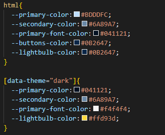
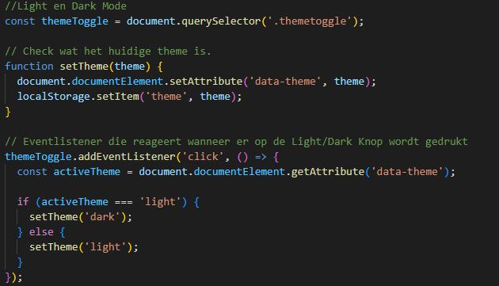

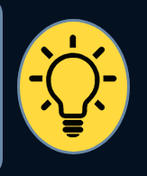
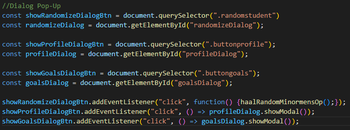
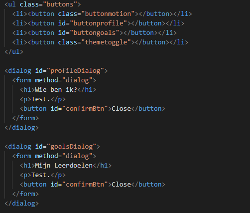
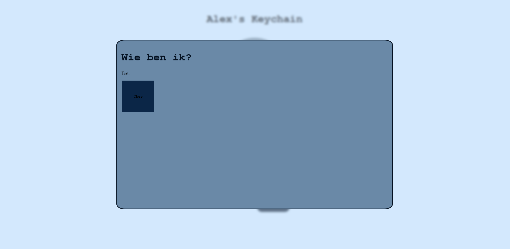
 

Hieronder zie je een aantal foto's van hoe mijn website er tot nu toe uitziet.

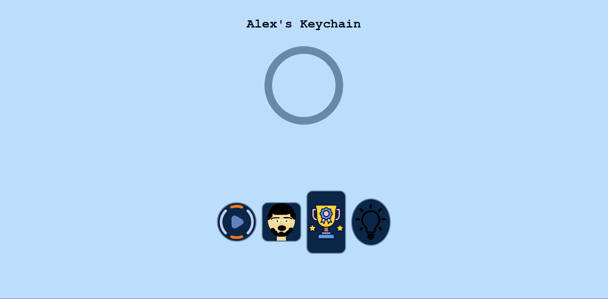
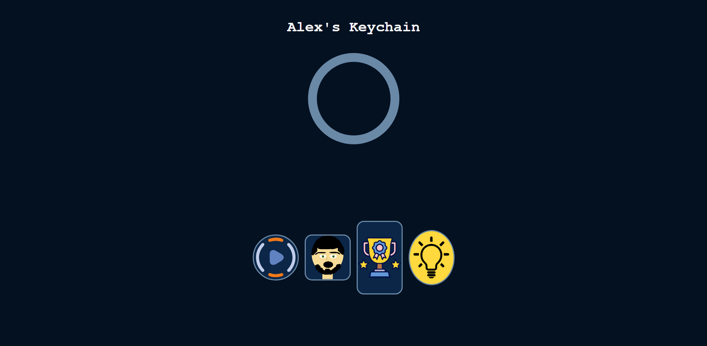
<h2>Dag 5 09/06/2026</h2>

<h3>Wat heb ik vandaag gedaan?</h3>

Maandag begonnen we met een intro, waarbij we te horen kregen wat de extra eis was. De extra eis is dat je door middel van API een aantal klasgenoten moest betrekken in je website. Na de intro ben ik de dag begonnen met kijken naar de WhoIs site. Ik zag dat er nieuwe regels waren, dus die heb ik gelijk aangevuld. Vorige week heb ik geleerd hoe ik een stukje tekst kon Parsen naar JSON. Dus dat heb ik ook gedaan om mijn custom velden te maken. Ik heb de kennis die ik vorige week heb gedaan toegepast om een stuk javascript te schrijven, hier was ik wel een tijdje mee bezig. Toen kwam ik mijn eerste probleem tegen, namelijk het aanroepen van die custom velden in mijn javascript. Ik heb vasillis om hulp gevraagd, en die had mij kort maar krachtig uitgelegd hoe het moest. Nu kan ik vanuit mijn API informatie halen over mezelf voor mijn leerdoelen en persoonlijke gedeelte, en voor de extra eis. Ik heb een plan gemaakt over wat ik wil doen voor de extra eis. Na eventjes nagedacht te hebben wist ik het. Ik wou iets maken wat mij eenbeetje beschreef. Ik heb heel vergeet achtig met mensen hun eigenschappen, dus dacht ik dat het een leuk idee was om een functie op mijn website te maken waarbij hij de eigenschappen van klasgenoten door elkaar heen haalt. Nadat ik de API werkend heb gekregen op mijn eigen data, ben ik verder gegaan met het positioneren van de data op de dialog. Ik wou dat je op een desktop 2 rijen zag, en als je naar telefoon switchen dat hij oversprong naar 1 rij. Hier heb ik even mee gestruggeld. Ik had een probleempje waardoor de grid niet wou luisteren, ma na eenbeetje hulp van Vasillis, is het me toch gelukt om het werkend te krijgen. Grid begreep mijn template niet, omdat het onlogisch was, ook moest ik de content die ik wou hebben in een grid binnen een div plaatsen, en moest ik display: grid; op de parent element plaatsen. Morgen wil ik verder met mijn leerdoelen aanvullen, daar was nog niet helemaal klaar mee. 

<h3>Hoelang duurde het?</h3>

Kijken naar WhoIs en aanvullen: 1 uur

API javascript maken: 2 uur

Plan maken voor extra eis: 1 uur

Dialog positioneren met Grid: 1 uur

Werken aan Readme: 1 uur

<h3>Wat heb ik geleerd?</h3>

Vandaag heb ik geleerd om de kennis die ik heb opgedaan bij workshops toe te passen. Ik heb geleerd hoe ik simpele code schrijf om een API toe te passen op mijn website. Ook heb ik geleerd hoe ik custom velden maak in een API, alleen vond ik het oproepen ervan nog lastig. Tenslotte weet ik nu hoe ik een logische grid-template maak en dat ik display: grid op een ouder element moet plaatsen.  

<h3>Wat ga ik morgen doen?</h3>

Morgen wil ik verder met de grid van mijn leerdoelen fixen, en leren hoe ik custom velden oproep. Ook wil ik eindelijk beginnen met de bolletjes van mijn sleutelhanger, want daar heb ik tot nu toe nog geen tijd voor gehad. 

<h2>Dag 6 10/06/2026</h2>

<h3>Wat heb ik vandaag gedaan?</h3>

Vandaag begon de dag met 2 workshops, ik volgde beide workshops van Cyd. Eentje ging over layouts, en de ander over goeie defaults en 'DRY' code. Ik heb veel van beide kunnen leren, alleen vind ik het persoonlijk fijner om te werken met grid box en een template dan wat Cyd had uitgelegd. Na de workshops ging ik aan de slag met mijn grid template. Na een lange tijd zoeken ben ik eindelijk tegengekomen wat de fout was. Namelijk dat er in de javascript geen DIV om de content zat, waardoor hij de template niet toepastte. Zo zie je maar dat foutjes liggen in een kleine hoek. Nu dat gefixt is heb ik de oefening die sanne mij heeft gegeven weer erbij gepakt. Het ging om een oefening waarbij ik de bolletjes moest laten slingeren. Na het bekijken van de oefening, begreep ik al heel wat meer dan eerst. Elke DIV is een bolletje, en die kan je aanspreken door middel van DIV DIV om een trainsitie te maken. Hiermee zeg je eigenlijk, elke div die in een div zit beweegt een stukje naar links of naar rechts. Ik had een probleempje waar ik tegenaan liep, en dat was dat ik mijn sleutelhanger knoppen in een UL LI had, waardoor de divs eromheen niet werkten. Dus heb ik een oplossing moeten zoeken. Ik heb cyd om hulp gevraagd, en die gaf mij een tip om te kijken naar een section. Ik ging in de tussentijd ook bezig met kijken naar hoe ik de custom velden die ik in WhoIs heb gemaakt kan oproepen in mijn API code. Vasillis had me hierbij geholpen. We gingen samen kijken naar wat er nog gedaan moest worden en de benaming van die velden. Er moest nog een JSON Parse stukje komen in mijn code, en de benaming had ik wel al goed. Het enige waar ik nog niet blij mee was was de positionering van de balletjes, want ze waren allemaal op 1 rij. Terwijl ze tegen het ringetje aan horen. Ik was blij met wat ik vandaag af had gekregen, maar ik ben nog niet klaar. Morgen moet ik nog best wel veel werk doen.

<h3>Hoelang duurde het?</h3>

Workshop's: 2 uur

Grid template fouten eruithalen: 1 uur

Bolletjes oefening + toepassen: 2 uur

JSON en Javascript: 1 uur

Werken aan Readme: 1 uur

<h3>Wat heb ik geleerd?</h3>

<h3>Wat ga ik morgen doen?</h3>

 Morgen is de laatste dag, en ik moet nog heel wat. Dus heb ik voor mezelf een To-Do List gemaakt. Die zie je hieronder.

 
<h3>To-Do List</h3>
<ul>
<li>Bolletjes laten uitlaten met de cirkel.</li>
<li>API eis voor mede-studenten fixen.</li>
<li>Read-Me bijhouden.</li>
 
<li>Als ik tijd overheb misschien een leuke soundeffect toevoegen.</li>
<li>Justus had aanbevolen om met een engine de keychain animatie te doen, zodat je sleutelhangers bewegen als je je telefoon kantelt. Dat iwl ik ook nog doen als ik tijd over heb.</li>
 

<h2>Dag 7 11/06/2026 WEEK2(AFRONDING)</h2>

<h3>Wat heb ik vandaag gedaan?</h3>

 Zoals je al kunt zien aan de To-Do list van gisteren, is er nog best veel wat af moet. Dus ik stress wel een beetje, of ik het nou af ga krijgen of niet. Ik vroeg Sanne of hij mij kon helpen met het uitlijnen van de cirkeltjes. Hij antwoorde met "Ja, maar het is wel een best vieze manier. Tegen niemand zeggen!". Hij legde me uit dat je - margin aan de eerste div kan geven, waardoor die meer omhoog komt te staan. (Sorry Sanne). Ik heb elke slinger ook een andere animation-duration gegeven, waardoor ze allemaal een unieke slinger effect/patroon hebben. Dat maakt het toch iets realistischer. Ik heb voor mijn extra eis geleerd om een filter toe te passen in javascript en om een rekensom te maken waardoor hij altijd een random getal uitkiest. Zo moet ik bij elke eigenschap die rekensom neerzetten zodat de gebruikers door elkaar gehusseld worden. Na vele uren proberen is het eindelijk gelukt, alleen ben ik er niet helemaal blij mee. Ik heb namelijk niet mijn persoonlijke API gedeelte en de Random gedeelte samengevoegd, omdat ik niet zo goed weet hoe ik het dan moet filteren en combineren. Maar daar was te weinig tijd voor over, ik hoop het te leren bij het volgende API project. Verder ben ik bezig geweest met de ReadMe bijvullen en kijken of ik overbodige code weg kan halen, zo heb ik alle inhoud van de dialogs weggehaald, omdat het toch wordt gevuld door de API. Morgen is de eindpresentatie.

<h3>Hoelang duurde het?</h3>

Bolletjes uitlijnen: 1 uur

Andere slinger animatie: 1 uur

Puntjes op de i: 1 uur

Randomize API: 3 uur

Werken aan Afsluiting en Readme: 1 uur

<h3>Wat heb ik geleerd?</h3>

Ik heb geleerd dat je soms vies mag coderen door bijvoorbeeld -margin te geven of door divs te gebruiken voor vormgeving, als het maar niet te vaak is. Verder weet ik nu dat je de animatie van een object kunt veranderen door een andere duration eraan te geven. Tenslotte is mij opgevallen dat javascript heel veel gebruik maakt van rekenmethodes. Ik begrijp het, maar zoals Sanne al zei, ik moet gewoon wat naampjes van js leren. 

<h3>Wat ga ik morgen doen?</h3>

Morgen ga ik mijzelf voorstellen aan het groepje door middel van mijn site, en daarna ga ik meedoen aan de tweede Marktje.

<h3>Wekelijkse Afsluiter</h3>

Afgelopen week heb ik geleerd hoe ik een API echt toepas in mijn eigen website. Ik heb custom velden aangemaakt, data geparsed naar JSON en geleerd hoe ik die velden kan ophalen en gebruiken in mijn JavaScript. In het begin vond ik het lastig om de custom velden correct aan te roepen, maar met wat hulp begrijp ik nu beter hoe de structuur van een API en JSON in elkaar zit.
 

Daarnaast heb ik geleerd hoe ik content in mijn website plaats met behulp Grid. Ik weet nu dat display: grid; op het parent-element moet staan en dat een logische grid-template belangrijk is. Kleine fouten kunnen ervoor zorgen dat een hele layout niet werkt. Dat heeft me geleerd om preciezer naar mijn code te kijken. Eerst keek ik nooit naar een website via inspect, maar nu weet ik dat je daar heel veel nuttige dingen uit kunt halen.

 

Mijn belangrijkste leerdoel is dat ik vaker mijn comfortzone wil stappen. En ik merk dat dat best goed is gelukt tijdens deze minor. Aan het begin wou ik een saaie porfolio maken, toen kwam Sanne bij mij langs. En vertelde mij dat mijn tweede idee veel beter was. Tijdens dit project heb ik geleerd om gewaagdere keuzes te maken, en om nieuwe technieken ook een kans te geven.

 

Ook heb ik gewerkt aan animaties, zoals het slinger-effect van de bolletjes. Ik heb geleerd hoe je met animation-duration variatie kunt aanbrengen, zodat animaties realistischer eruit zien. Soms heb ik “vieze” oplossingen gebruikt, zoals een negatieve margin. Maar dat mag, zolang je weet waarom je het doet, en het niet te vaak doet.

 

Voor de extra eis heb ik geleerd hoe ik met JavaScript een filter en een random-functie kan gebruiken om klasgenoten door elkaar te husselen. Daarbij merkte ik dat JavaScript veel gebruikmaakt van rekenmethodes. Ik begrijp de basis, maar ik wil daar nog verder in groeien.

 

Tot slot heb ik geleerd beter om te gaan met tijdsdruk. Ondanks stress heb ik veel kunnen afronden, mijn code opgeschoond en mijn ReadMe bijgewerkt. Als ik nog meer tijd had zou ik wel wat extra functies willen toevoegen aan mijn site. Zoals een soundeffect bij het slingeren van de sleutelhangers, of als je te vaak op de bright/dark knop drukt dat de lamp dan kapot gaat. Hieronder zie je een aantal screenshots waar ik trots op ben.

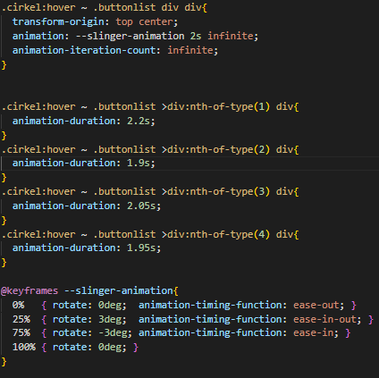
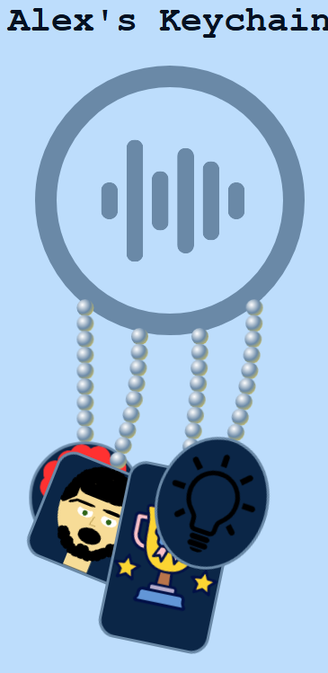
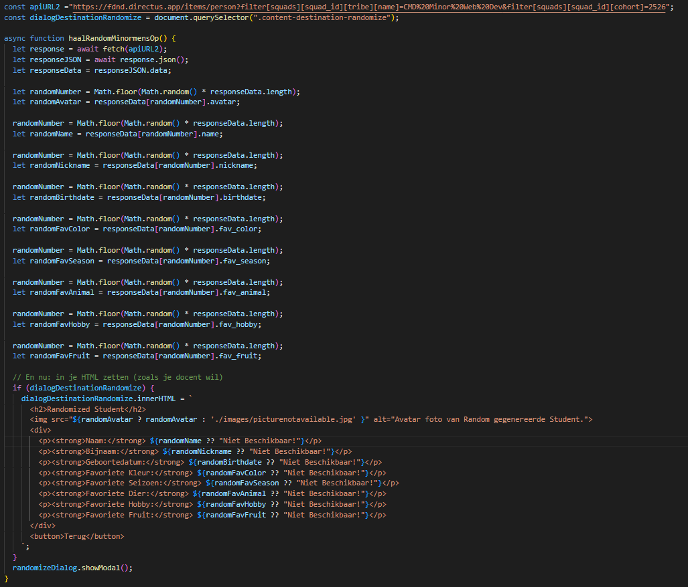
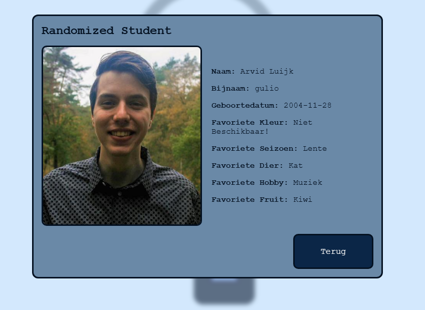
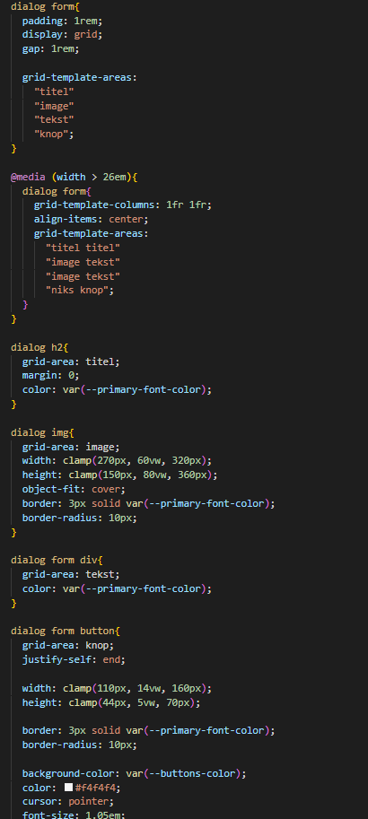
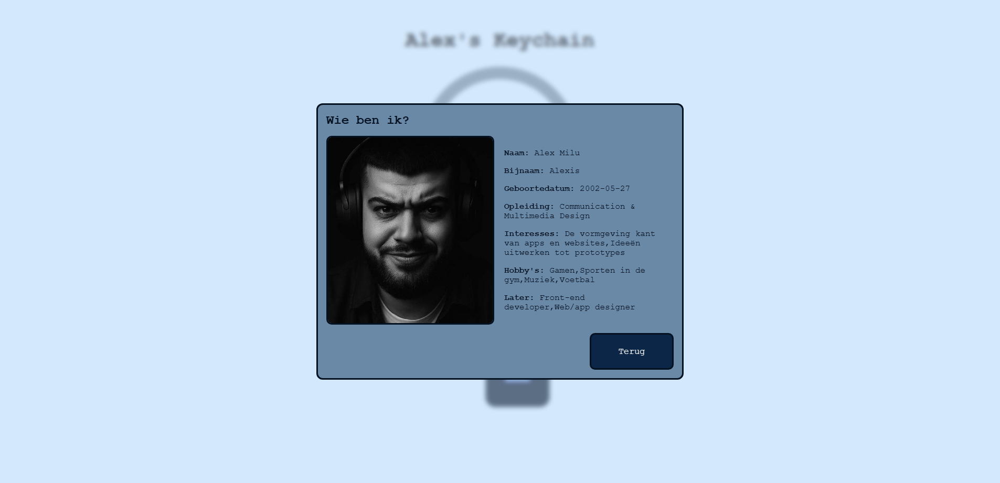

 

Hieronder zie je een aantal foto's van hoe mijn website er tot nu toe uitziet.

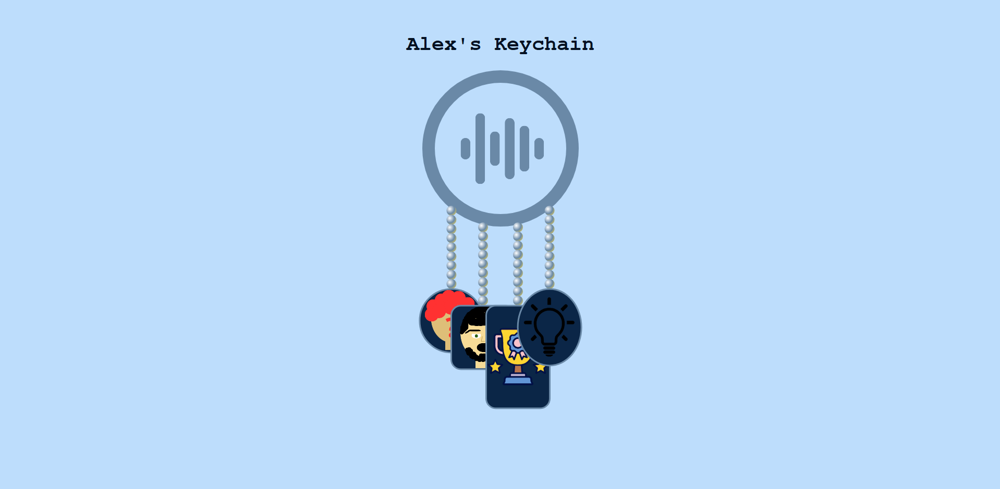
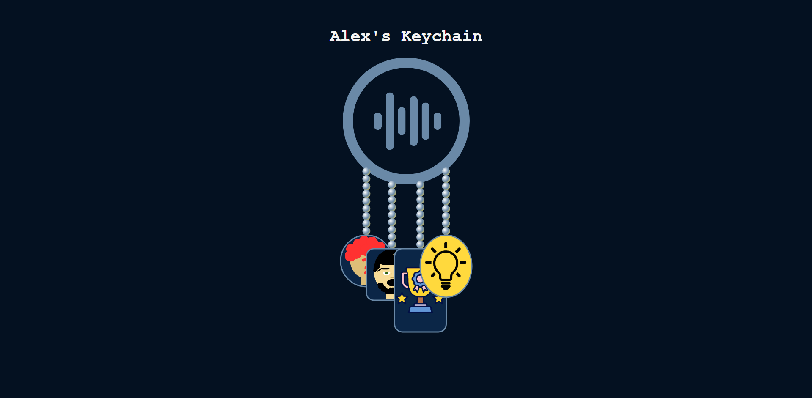
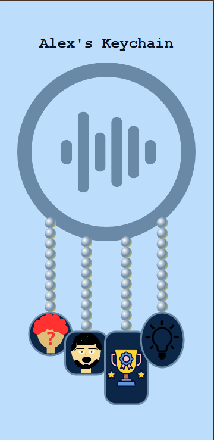
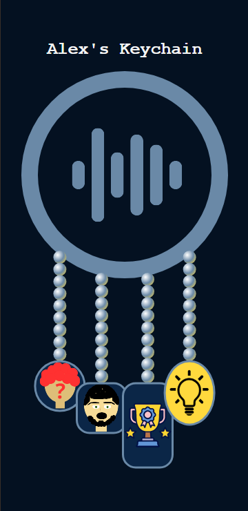